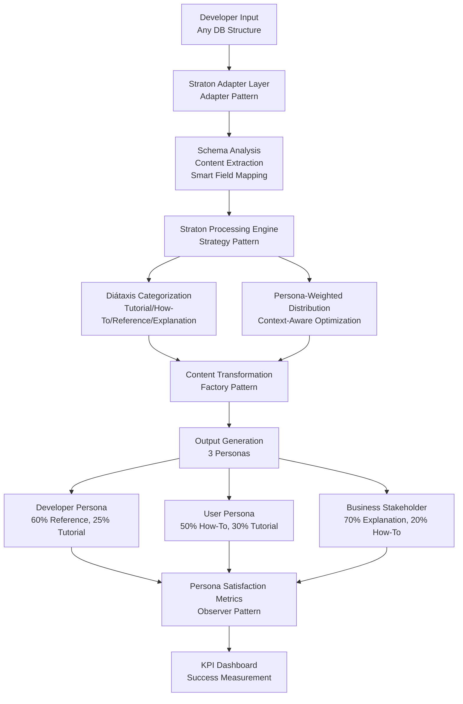

# UI/UX Upgrade Plan with Straton System Architecture

**Project:** StratonHub Documentation Platform
**Version:** 2.0.0
**Date:** [Current Date]
**Status:** [Draft/In Review/Approved/In Progress]

---

## Executive Summary

This document outlines a comprehensive UI/UX upgrade plan for the StratonHub documentation platform, integrating the **Straton System Architecture** as the core framework for content processing and persona-weighted distribution. The plan focuses on improving user experience, accessibility, visual design, and overall platform usability while maintaining performance and developer experience.

**Note:** This document contains both baseline improvements (Sections 1-9, 11-15) that work independently as a generic upgrade template, and Straton System Architecture enhancements (Section 5) that provide advanced content processing capabilities. The baseline content can be implemented without Straton, while Straton provides an optional upgrade path for enhanced content processing and persona optimization.

### Key Objectives

- Implement **Straton System Architecture** for intelligent content processing and persona-weighted distribution
- Enhance user engagement and content discoverability through Diátaxis framework integration
- Implement WCAG 2.1 AA/AAA dual-mode compliance system with toggle
- Modernize visual design and interaction patterns
- Optimize mobile and tablet experiences
- Streamline content consumption workflows
- Provide accessible AAA mode for users who need enhanced accessibility while maintaining beautiful AA design as default

---

## 1. Current State Assessment

### 1.1 Technology Stack

- **Framework:** Next.js 16.1.1
- **UI Library:** shadcn/ui (Radix UI primitives)
- **Styling:** Tailwind CSS 4.1.18
- **Theme System:** next-themes (light/dark mode)
- **Accessibility Mode:** WCAG AA (default) / AAA (toggle) - Dual-mode system
- **Typography:** Inter font
- **Content:** MDX/Markdown
- **Content Processing:** Basic (Baseline) / Straton System Architecture (Enhanced)

### 1.2 Current Strengths

✅ Modern tech stack with excellent performance
✅ Responsive design foundation
✅ Dark mode support
✅ Accessible component library (Radix UI)
✅ Clean, minimal design aesthetic
✅ SEO-optimized structure

### 1.3 Identified Areas for Improvement

#### User Experience
- [ ] Navigation discoverability
- [ ] Search experience enhancement
- [ ] Mobile navigation patterns
- [ ] Content reading experience
- [ ] Loading states and feedback
- [ ] Error handling and messaging

#### Visual Design
- [ ] Visual hierarchy refinement
- [ ] Spacing and layout consistency
- [ ] Typography scale optimization
- [ ] Color system enhancement
- [ ] Icon system standardization
- [ ] Animation and micro-interactions

#### Accessibility
- [ ] WCAG AA/AAA dual-mode toggle system
- [ ] Keyboard navigation improvements
- [ ] Screen reader optimization
- [ ] Focus management
- [ ] Color contrast verification (AA and AAA modes)
- [ ] ARIA labeling
- [ ] Skip navigation links
- [ ] Accessibility mode toggle component

#### Performance
- [ ] Image optimization
- [ ] Code splitting strategies
- [ ] Loading performance metrics
- [ ] Core Web Vitals optimization

#### Content Processing (Straton Enhancement)
- [ ] Straton System Architecture implementation
- [ ] Adaptive input processing (Adapter Pattern)
- [ ] Persona-weighted content distribution
- [ ] Context-aware content optimization

---

## 2. User Research & Personas

### 2.1 Primary Reading Personas

#### Persona 1: Developer (Dev)
- **Role:** Software developers, engineers, technical contributors
- **Goals:**
  - Quickly find API references and technical specifications
  - Understand implementation details and code examples
  - Get hands-on with code and technical tutorials
  - Reference technical documentation for integration
- **Reading Patterns:**
  - Prefers Reference and Tutorial content types (Diátaxis)
  - Frequent use of code examples and API documentation
  - Quick scanning for specific information
  - Deep dives into technical explanations
- **Pain Points:**
  - Search limitations for technical terms
  - Code readability and syntax highlighting
  - Incomplete or outdated API references
  - Lack of practical examples
- **Needs:**
  - Fast search with technical term filtering
  - Clear code examples with copy functionality
  - Quick navigation to relevant sections
  - Interactive code examples
  - Version-specific documentation
  - Complete API references

**Straton Enhancement:** Developer persona receives 60% Reference content, 25% Tutorials, 10% How-To, 5% Explanation through persona-weighted distribution.

#### Persona 2: User
- **Role:** End users, product users, non-technical users
- **Goals:**
  - Learn how to use the product effectively
  - Complete specific tasks and workflows
  - Understand features and capabilities
  - Troubleshoot common issues
- **Reading Patterns:**
  - Prefers How-To Guides and Tutorials (Diátaxis)
  - Step-by-step learning approach
  - Visual guides and screenshots
  - Task-oriented content consumption
- **Pain Points:**
  - Information overload
  - Unclear step-by-step instructions
  - Lack of visual aids
  - Difficulty finding relevant guides
  - Technical jargon and complexity
- **Needs:**
  - Clear, actionable step-by-step guides
  - Visual guides and illustrations
  - Simple, jargon-free language
  - Task-based navigation
  - Quick start guides
  - Troubleshooting sections
  - Prerequisites and requirements clearly stated

**Straton Enhancement:** User persona receives 50% How-To Guides, 30% Tutorials, 15% Explanation, 5% Reference through persona-weighted distribution.

#### Persona 3: Business Stakeholder
- **Role:** Product managers, executives, decision-makers, business analysts
- **Goals:**
  - Understand product features and capabilities at a high level
  - Evaluate product potential and use cases
  - Make informed business decisions
  - Understand strategic positioning and value proposition
- **Reading Patterns:**
  - Prefers Explanation and overview content (Diátaxis)
  - High-level understanding over technical details
  - Strategic and conceptual information
  - Quick scanning and executive summaries
- **Pain Points:**
  - Too much technical detail
  - Lack of business context
  - Information overload
  - Difficulty understanding value proposition
  - Time constraints
- **Needs:**
  - Clear hierarchy and overview sections
  - Executive summaries and key takeaways
  - Business value and use case information
  - Visual summaries and infographics
  - Conceptual explanations without deep technical details
  - Strategic positioning information
  - ROI and benefit-focused content
  - Easy scanning with clear visual hierarchy

**Straton Enhancement:** Business Stakeholder persona receives 70% Explanation content, 20% How-To Guides (high-level), 5% Reference, 5% Tutorials through persona-weighted distribution.

### 2.2 Persona-Content Type Mapping (Diátaxis Alignment)

| Persona                  | Primary Content Types    | Secondary Content Types    | Reading Style                         |
| ------------------------ | ------------------------ | -------------------------- | ------------------------------------- |
| **Developer**            | Reference, Tutorials     | How-To Guides              | Technical, code-focused, quick lookup |
| **User**                 | How-To Guides, Tutorials | Reference                  | Step-by-step, task-oriented, visual   |
| **Business Stakeholder** | Explanation              | How-To Guides (high-level) | Strategic, conceptual, quick scanning |

**Straton Integration:** This mapping is implemented through Straton's persona-weighted distribution algorithm, which dynamically adjusts content prioritization based on persona context and user journey stage.

### 2.3 User Journey Maps

*[Document key user journeys for each persona: onboarding, content discovery, content consumption, search, navigation]*

#### Developer Journey
- API lookup → Reference documentation → Code examples → Implementation
- Learning new technology → Tutorial → Hands-on practice → Reference check

**Straton Enhancement:** Context-aware content type prioritization - when troubleshooting, Reference content is promoted; when learning, Tutorials are prioritized.

#### User Journey
- Task initiation → How-To Guide → Step-by-step execution → Task completion
- Feature discovery → Tutorial → Understanding → Practical application

**Straton Enhancement:** Task-based content flow - How-To Guides with wizard-like interfaces are prioritized during task execution.

#### Business Stakeholder Journey
- Product evaluation → Explanation content → Strategic overview → Decision making
- Feature assessment → High-level overview → Use cases → Business value analysis

**Straton Enhancement:** Summary-first approach - Explanation content with executive summaries is prioritized for quick strategic understanding.

---

## 3. Design Principles

### 3.1 Core Principles

1. **Clarity First:** Prioritize readability and information hierarchy
2. **Progressive Disclosure:** Show relevant information when needed
3. **Consistent Patterns:** Reusable components and interactions
4. **Dual-Mode Accessibility:** WCAG 2.1 AA (default - beautiful design) / AAA (toggle - enhanced accessibility without color bloat)
5. **Performance Conscious:** Fast, responsive experiences
6. **Mobile-First:** Optimize for all device sizes
7. **User Choice:** Toggle between aesthetic beauty (AA) and maximum accessibility (AAA)
8. **Adaptive Content Processing:** Straton System Architecture enables intelligent content distribution based on persona and context

### 3.2 Design System Foundation

- **Base Color:** Zinc (maintain consistency)
- **Color Mode:** Light/Dark themes
- **Accessibility Mode:** WCAG AA (default) / AAA (toggle)
- **Typography Scale:** Inter font family
- **Spacing System:** 8px base unit
- **Border Radius:** 0.625rem (consistent with current)
- **Content Processing:** Baseline (Generic) / Straton (Persona-Weighted)

### 3.3 WCAG Compliance Strategy: Dual-Mode System

#### Default Mode: WCAG 2.1 AA (Aesthetic Mode)
- **Purpose:** Maintain the beautiful, original design aesthetic
- **Target:** Standard users who appreciate visual design
- **Characteristics:**
  - Original color palette preserved
  - Balanced contrast ratios meeting AA standards
  - Visual design integrity maintained
  - Focus on beauty and user experience

#### Enhanced Mode: WCAG 2.1 AAA (Accessibility Mode)
- **Purpose:** Maximum accessibility for users who need enhanced compliance
- **Target:** Users with visual impairments, color blindness, and accessibility needs
- **Characteristics:**
  - Enhanced contrast ratios meeting AAA standards (7:1 for normal text, 4.5:1 for large text)
  - Optimized color system avoiding color bloat
  - Enhanced focus indicators
  - Clear visual distinctions without relying solely on color
  - Maximum readability and usability

#### Toggle System Implementation
- **User Control:** Toggle switch in user settings/preferences
- **Persistent:** User preference saved (localStorage/cookies)
- **Universal:** Applies across all pages and components
- **Seamless:** Smooth transition between modes
- **Discoverable:** Clear indication in UI (preferably in header/navigation)

---

## 4. Component & System Improvements

### 4.1 Navigation System

#### Current State
- Navbar with basic navigation
- Sidebar navigation structure
- Footer navigation

#### Proposed Enhancements
- [ ] Breadcrumb improvements (visibility, styling)
- [ ] Mobile hamburger menu optimization
- [ ] Active state enhancements
- [ ] Sticky navigation behavior
- [ ] Search integration in navigation
- [ ] Quick links/shortcuts

**Priority:** High
**Estimated Effort:** 2-3 weeks

**Straton Enhancement:** Persona-aware navigation - different navigation structures optimized for each persona type, with content type filtering based on persona preferences.

### 4.2 Search Experience

#### Current State
- Basic search functionality
- Fuzzy search with highlighting

#### Proposed Enhancements
- [ ] Search result previews
- [ ] Recent searches history
- [ ] Search filters/categories
- [ ] Keyboard shortcuts (Cmd/Ctrl + K)
- [ ] Search analytics
- [ ] Empty states improvement

**Priority:** High
**Estimated Effort:** 3-4 weeks

**Straton Enhancement:** Persona-weighted search results - Developer persona gets advanced technical search, User persona gets simple task-based search, Business Stakeholder gets summary-focused search.

### 4.3 Content Display & Reading (Diátaxis Framework Compliance)

#### Current State
- MDX content rendering
- Table of contents
- Code highlighting
- Basic content structure

#### Diátaxis Framework Overview
The Diátaxis framework categorizes documentation into four distinct modes, each serving a different user need:

1. **Tutorials** (Learning-oriented)
   - Step-by-step, hands-on learning
   - Progressive skill building
   - Guided experience from start to finish

2. **How-To Guides** (Problem-oriented)
   - Goal-focused, practical instructions
   - Task completion focused
   - Clear, actionable steps

3. **Reference** (Information-oriented)
   - Complete, accurate information
   - Quick lookup capability
   - Factual, systematic presentation

4. **Explanation** (Understanding-oriented)
   - Discursive, illuminating content
   - Background and context
   - Conceptual understanding

#### Proposed Enhancements

##### Diátaxis Framework Implementation
- [ ] Content type categorization system (Tutorial/How-To/Reference/Explanation)
- [ ] Visual identifiers/badges for each content type
- [ ] Content type metadata and schema
- [ ] Navigation filtering by content type
- [ ] Landing pages for each documentation type
- [ ] Content type-specific layouts and styling
- [ ] Search filtering by content type
- [ ] Related content suggestions based on content type

##### Reading Experience Improvements (Diátaxis-Aware)
- [ ] **Tutorial Mode:**
  - [ ] Step-by-step progress indicator
  - [ ] Sequential navigation (prev/next)
  - [ ] Completion checkpoints
  - [ ] Interactive elements for hands-on learning
  - [ ] Estimated completion time per step

- [ ] **How-To Guide Mode:**
  - [ ] Clear action-oriented headings
  - [ ] Numbered step indicators
  - [ ] Quick reference sidebar
  - [ ] Prerequisites and requirements display
  - [ ] Troubleshooting sections

- [ ] **Reference Mode:**
  - [ ] Quick navigation (alphabetical/index)
  - [ ] Expandable/collapsible sections
  - [ ] Cross-reference linking
  - [ ] Copy-to-clipboard for code/commands
  - [ ] Version information display
  - [ ] Parameter/API documentation tables

- [ ] **Explanation Mode:**
  - [ ] Enhanced typography for longer-form content
  - [ ] Visual hierarchy for complex concepts
  - [ ] Related concepts linking
  - [ ] Background context sections
  - [ ] Diagram and illustration support

##### Universal Reading Enhancements
- [ ] Reading progress indicator (type-aware)
- [ ] Improved typography (line-height, spacing, readability)
- [ ] Print-friendly styles (content type-specific)
- [ ] Copy-to-clipboard enhancements
- [ ] Content annotations/highlights
- [ ] Related content suggestions (Diátaxis-aware)
- [ ] Reading time estimates (content type-specific)
- [ ] Table of contents (adaptive to content type)
- [ ] Breadcrumb navigation with content type context
- [ ] Visual separation between content types

##### Content Organization & Navigation
- [ ] Clear separation between documentation types
- [ ] Consistent structure within each type
- [ ] Landing pages with overview for each type
- [ ] Hierarchical organization respecting Diátaxis principles
- [ ] Avoid mixing different content types
- [ ] Type-specific navigation patterns

**Priority:** High
**Estimated Effort:** 4-5 weeks (includes content analysis, categorization, and implementation)

**Straton Enhancement:** All Diátaxis content types are available to all personas, but Straton's persona-weighted distribution algorithm optimizes which content types are prioritized and presented based on persona context and user journey stage.

### 4.4 Code Display

#### Current State
- Syntax highlighting
- Code block titles
- Copy functionality

#### Proposed Enhancements
- [ ] Line number toggles
- [ ] Code block expand/collapse
- [ ] Multi-language code tabs
- [ ] Code diff view support
- [ ] Interactive code examples
- [ ] Code formatting improvements

**Priority:** Medium
**Estimated Effort:** 2 weeks

### 4.5 Mobile Experience

#### Current State
- Responsive layout
- Mobile navigation

#### Proposed Enhancements
- [ ] Touch gesture improvements
- [ ] Mobile-optimized spacing
- [ ] Bottom navigation bar (mobile)
- [ ] Swipe gestures for navigation
- [ ] Mobile search optimization
- [ ] Touch target size optimization (44x44px minimum)

**Priority:** High
**Estimated Effort:** 2-3 weeks

---

## 5. Straton System Architecture

### 5.1 Overview

**Straton System Architecture** is a Diátaxis-first documentation processing framework that implements persona-weighted content distribution through industry-standard design patterns. The system accepts any database structure through an Adapter Pattern implementation, processes content through the Diátaxis framework, and generates optimized output for three distinct personas (Developer, User, Business Stakeholder).

**Core Philosophy:**
- **Input-Output Circular Dependency:** Output requirements determine input needs; input capabilities determine output possibilities. The system adapts to work with any input structure while optimizing for desired outputs.
- **Persona Satisfaction as KPI:** Personas judge the output quality. If output doesn't match persona needs (e.g., providing pork when chicken is needed), the system fails. Persona satisfaction metrics drive success.
- **Baseline Independence:** All baseline improvements (Sections 1-4, 6-9, 11-15) work independently as a generic upgrade template. Straton provides an optional enhancement layer for advanced content processing.

**Industry Best Practices Applied:**
- **Adapter Pattern** (Gang of Four): Enables flexible input processing from any database structure
- **Strategy Pattern** (Gang of Four): Implements persona-weighted distribution algorithms
- **Factory Pattern** (Gang of Four): Generates persona-specific content outputs
- **Observer Pattern** (Gang of Four): Tracks KPI metrics and persona satisfaction

### 5.2 System Architecture

#### Architecture Flow



#### Component Architecture

**Input Layer (Adapter Pattern):**
- Accepts any database structure (Type 1: Minimal/SIF format, Type 2: Full database)
- Schema analysis and inference
- Content extraction (extract only what's needed)
- Smart field mapping to internal format

**Processing Layer (Strategy Pattern):**
- Diátaxis framework categorization
- Persona-weighted distribution algorithm
- Context-aware content optimization
- User journey tracking and adaptation

**Output Layer (Factory Pattern):**
- Persona-specific content generation
- Content type-specific layouts
- Dynamic content prioritization
- Multi-format output (MDX, HTML, JSON)

**Monitoring Layer (Observer Pattern):**
- Real-time KPI tracking
- Persona satisfaction metrics
- Usage analytics
- Performance monitoring

### 5.3 Input Specification: Adapter Pattern Implementation

#### Industry Best Practice: Adapter Pattern (Gang of Four)

The Adapter Pattern allows Straton to work with incompatible interfaces by converting one interface into another. This enables the system to accept any database structure while processing it through a standardized internal format.

#### Input Types Supported

**Type 1: Minimal Input (Developer asks "What do you need?")**
- **Format:** Straton Input Format (SIF) - Structured JSON Schema
- **Advantages:** Optimized processing, better output quality, faster processing time
- **Use Case:** Developers who want to provide exactly what's needed

**Type 2: Full Database (Developer gives everything)**
- **Format:** Complete database dump/export (any structure)
- **Advantages:** No upfront formatting required, immediate processing, maximum flexibility
- **Use Case:** Developers who prefer to provide complete data and let Straton extract what's needed

#### Straton Input Format (SIF) - Recommended Format

For developers who want to provide optimized input, following industry best practices for structured data exchange:

**JSON Schema Structure:**
```json
{
  "$schema": "http://json-schema.org/draft-07/schema#",
  "type": "object",
  "properties": {
    "metadata": {
      "version": "string",
      "lastUpdated": "datetime",
      "source": "string"
    },
    "content": {
      "type": "array",
      "items": {
        "type": "object",
        "properties": {
          "id": "string",
          "type": {
            "type": "string",
            "enum": ["tutorial", "howto", "reference", "explanation"]
          },
          "title": "string",
          "content": "string",
          "personaWeights": {
            "developer": "number",
            "user": "number",
            "businessStakeholder": "number"
          },
          "metadata": {
            "tags": "array",
            "difficulty": {
              "type": "string",
              "enum": ["beginner", "intermediate", "advanced"]
            },
            "estimatedTime": "number",
            "prerequisites": "array"
          }
        },
        "required": ["id", "type", "title", "content"]
      }
    }
  }
}
```

**Migration Path:**
- Developers can start with any format (database dump, CSV, JSON, etc.)
- Straton adapter processes it automatically
- Optional upgrade to SIF format for optimization
- Easy migration guide and tools provided

#### Adapter Layer Functionality

**1. Schema Analysis**
- Auto-detect database structure
- Identify content entities and relationships
- Extract metadata and field types
- Map to Straton internal format

**2. Content Extraction**
- Extract only required fields (avoid unnecessary data processing)
- Filter irrelevant data
- Normalize structures across different input formats
- Preserve relationships and hierarchies

**3. Smart Field Mapping**
- Map external schema to Straton internal format
- Handle schema variations and naming conventions
- Preserve data integrity
- Log transformation rules for transparency

**Technology Stack (Industry Best Practices):**
- Schema inference algorithms (machine learning-based)
- Data transformation pipelines (ETL principles)
- Validation and error handling (robust error recovery)
- Logging and monitoring (observability)

### 5.4 Processing Engine: Diátaxis + Persona-Weighted Distribution

#### Diátaxis Framework Integration

**Content Categorization Algorithm:**
1. **Tutorials Detection:**
   - Progressive skill building patterns
   - Step-by-step learning sequences
   - Interactive element identification
   - Hands-on practice indicators

2. **How-To Guides Detection:**
   - Task-oriented content patterns
   - Problem-solution structures
   - Action-oriented language
   - Workflow sequences

3. **Reference Detection:**
   - API documentation patterns
   - Quick lookup structures
   - Systematic information organization
   - Factual, non-narrative content

4. **Explanation Detection:**
   - Conceptual content patterns
   - Background and context indicators
   - Strategic and high-level information
   - Discursive, narrative structures

#### Persona-Weighted Distribution Algorithm (Strategy Pattern)

**Distribution Matrix:**

| Content Type    | Developer Weight | User Weight   | Business Stakeholder Weight |
| --------------- | ---------------- | ------------- | --------------------------- |
| **Reference**   | 60% (Primary)    | 5%            | 5%                          |
| **Tutorials**   | 25%              | 30%           | 5%                          |
| **How-To**      | 10%              | 50% (Primary) | 20%                         |
| **Explanation** | 5%               | 15%           | 70% (Primary)               |

**Context-Aware Optimization:**
- **User Journey Tracking:** Monitor persona's current stage (learning, executing, troubleshooting)
- **Moment-Based Prioritization:** Adjust content type weights based on current context
- **Dynamic Weight Adjustment:** Learn from user behavior and adapt distribution
- **Learning Pattern Adaptation:** Optimize based on successful task completions

**Industry Best Practices Applied:**
- **Content-Based Filtering** (Information Retrieval): Analyze content characteristics
- **Collaborative Filtering** (Recommendation Systems): Learn from similar users
- **Personalization Algorithms** (E-commerce patterns): Adapt to individual preferences
- **A/B Testing Framework** (Optimization): Continuously improve distribution

### 5.5 Output Specification: Three Personas

#### Output Format

**Base Format:** MDX/Markdown with comprehensive metadata
**Structure:** Diátaxis-organized, persona-optimized
**Delivery:** Context-aware, dynamically prioritized

#### Persona-Specific Outputs

**Developer Persona Output:**
- **Primary Content:** Reference (60%), Tutorials (25%)
- **Format:** Compact, dense, information-rich
- **Features:**
  - Advanced search with code/API filtering
  - Quick navigation to code examples
  - API reference documentation
  - Interactive code examples
  - Version-specific information
- **Layout:** Minimal UI, maximum information density
- **Accessibility:** AA mode (developers prefer minimal UI, not AAA bloat)

**User Persona Output:**
- **Primary Content:** How-To Guides (50%), Tutorials (30%)
- **Format:** Step-by-step, visual, wizard-like
- **Features:**
  - Interactive wizards for workflows
  - Task-based navigation
  - Visual guides and illustrations
  - Simple, jargon-free language
  - Progress indicators
- **Layout:** Spacious, guided, progressive disclosure
- **Accessibility:** AAA toggle available (users may need enhanced accessibility)

**Business Stakeholder Persona Output:**
- **Primary Content:** Explanation (70%), How-To Guides high-level (20%)
- **Format:** Executive summaries, strategic overviews
- **Features:**
  - Summary-first approach
  - High-level concepts
  - Business value metrics
  - ROI information
  - Strategic positioning
- **Layout:** Scannable, summary-first, visual hierarchy
- **Accessibility:** AAA toggle available

#### Output Quality Criteria

- **Relevance:** Content matches persona needs (persona judges output)
- **Completeness:** All required information present
- **Clarity:** Clear, understandable format
- **Accessibility:** WCAG AA/AAA compliance
- **Performance:** Fast loading, optimized delivery
- **Context-Aware:** Right content type at the right moment

### 5.6 KPI Framework: Persona Satisfaction Metrics

#### Success Metrics (Industry Best Practices)

**Primary KPI: Persona Satisfaction Score**

The fundamental principle: **Personas judge the output.** If we provide pork but the persona wants chicken, the system fails. Persona satisfaction is the ultimate success metric.

**1. Developer Satisfaction (35% weight)**
- **Search Effectiveness:** Target >85% (can find needed information quickly)
- **Task Completion Rate:** Target >90% (successfully complete technical tasks)
- **Time to Find Information:** Target <30 seconds (quick lookup capability)
- **Content Relevance Score:** Target >8.5/10 (content matches developer needs)
- **API Reference Completeness:** Target 100% (all APIs documented)

**2. User Satisfaction (45% weight)**
- **Wizard Completion Rate:** Target >80% (successfully complete guided workflows)
- **Task Success Rate:** Target >85% (complete intended tasks)
- **Time to Complete Task:** Target <5 minutes (efficient task execution)
- **Helpfulness Rating:** Target >8.5/10 (content is helpful and clear)
- **Visual Guide Effectiveness:** Target >80% (visual aids improve understanding)

**3. Business Stakeholder Satisfaction (20% weight)**
- **Summary Clarity:** Target >85% (executive summaries are clear and actionable)
- **Decision-Making Confidence:** Target >80% (can make informed decisions)
- **Time to Understand Value:** Target <2 minutes (quick strategic understanding)
- **Strategic Insight Score:** Target >8.5/10 (content provides strategic value)
- **Business Value Clarity:** Target >85% (ROI and benefits are clear)

**Measurement Methods (Industry Standard):**
- **Analytics Tracking:** Google Analytics, custom analytics, usage patterns
- **User Feedback Surveys:** Post-task surveys, satisfaction ratings
- **A/B Testing:** Compare different content distributions
- **Usage Pattern Analysis:** Track content consumption patterns
- **Task Completion Monitoring:** Measure success rates for key tasks

**KPI Dashboard:**
- Real-time metrics display
- Trend analysis and forecasting
- Persona-specific breakdowns
- Comparative analysis (baseline vs. Straton-enhanced)
- Alert system for satisfaction drops

### 5.7 "Way Out" - Flexibility & Fallback Strategies

#### Graceful Degradation (Industry Best Practice)

The "way out" refers to Straton's flexibility and fallback mechanisms when preferred content or formats are unavailable.

**1. Content Type Fallback:**
- If preferred content type unavailable → Use alternative type
- Maintain persona weighting when possible
- Ensure all personas have access to all content types
- Clear indication of content type availability

**2. Schema Fallback:**
- If structured format unavailable → Parse unstructured content
- Use NLP for content categorization
- Manual review option for edge cases
- Progressive enhancement approach

**3. Persona Fallback:**
- If persona-specific content unavailable → Generic content with clear labeling
- Weighted distribution adjustment
- Clear indication of content type and persona alignment
- Maintain quality standards

**Quality Assurance:**
- Content validation (automated checks)
- Schema verification (structure validation)
- Output quality checks (persona alignment verification)
- Automated testing (regression prevention)

### 5.8 Developer Integration Guide

#### For Type 1 Developers (Minimal Input - "What do you need?")

**Recommended Approach:**
1. Review Straton Input Format (SIF) specification
2. Provide structured schema definition
3. Specify content metadata
4. Use SIF JSON format

**Benefits:**
- Optimized processing
- Better output quality
- Faster processing time
- Reduced errors
- Predictable results

**SIF Format Advantages:**
- Explicit content type categorization
- Persona weight specification
- Rich metadata support
- Validation-friendly structure

#### For Type 2 Developers (Full Database - "Here's everything")

**Recommended Approach:**
1. Provide database export/dump (any format)
2. Include schema information if available
3. Straton adapter processes automatically
4. Optional: Migrate to SIF format later for optimization

**Benefits:**
- No upfront formatting required
- Immediate processing capability
- Maximum flexibility
- Easy migration path to SIF

**Adapter Processing:**
- Automatic schema detection
- Smart field mapping
- Content extraction
- Format normalization

#### Migration Path (Industry Best Practice)

**Progressive Enhancement:**
1. **Start:** Any format (adapter handles it)
2. **Review:** Output quality and persona satisfaction
3. **Optimize:** Optionally migrate to SIF format
4. **Improve:** Continuous refinement based on KPI metrics

**Migration Tools:**
- Schema converter (automatic conversion to SIF)
- Data transformer (format normalization)
- Validation tools (quality assurance)
- Quality checker (persona alignment verification)

### 5.9 Technical Implementation

#### Technology Stack (Industry Best Practices)

**Adapter Layer:**
- **Language:** TypeScript/Node.js
- **Patterns:** Adapter Pattern (Gang of Four)
- **Tools:** Schema inference libraries, data transformation frameworks
- **Validation:** JSON Schema validation, type checking

**Processing Engine:**
- **Algorithms:** Diátaxis categorization, persona weighting algorithms
- **Patterns:** Strategy Pattern (Gang of Four) for distribution
- **Tools:** Content analysis libraries, NLP for categorization
- **Optimization:** Context-aware algorithms, machine learning for adaptation

**Output Generation:**
- **Patterns:** Factory Pattern (Gang of Four) for content generation
- **Formats:** MDX/Markdown processing, template engine
- **Layouts:** Persona-specific layouts, responsive design
- **Performance:** Caching, lazy loading, optimization

**Monitoring & Analytics:**
- **Patterns:** Observer Pattern (Gang of Four) for KPI tracking
- **Tools:** Logging framework, analytics integration
- **Metrics:** Real-time KPI tracking, performance monitoring
- **Dashboards:** Visualization tools, alert systems

#### Architecture Principles

**Design Patterns (Gang of Four):**
- **Adapter Pattern:** Input flexibility and format conversion
- **Strategy Pattern:** Persona-weighted distribution algorithms
- **Factory Pattern:** Persona-specific content generation
- **Observer Pattern:** KPI tracking and metrics collection

**SOLID Principles:**
- **Single Responsibility:** Each component has one clear purpose
- **Open/Closed:** Extensible without modification
- **Liskov Substitution:** Interchangeable implementations
- **Interface Segregation:** Focused, specific interfaces
- **Dependency Inversion:** Depend on abstractions, not concretions

**Content Strategy:**
- **Diátaxis Framework:** Industry-standard documentation categorization
- **Persona-Based Design:** UX best practice for user-centric design
- **Context-Aware Systems:** Industry standard for intelligent systems
- **Personalization:** E-commerce/AI patterns for user experience

**Quality Assurance:**
- **Automated Testing:** Unit, integration, end-to-end tests
- **Continuous Integration:** Automated quality checks
- **Performance Monitoring:** Real-time performance tracking
- **User Feedback Loops:** Continuous improvement based on persona satisfaction

---

## 6. Visual Design Improvements

### 6.1 Color System

#### Current Palette
- Base: Zinc
- CSS Variables: OKLCH format

#### Proposed Enhancements
- [ ] Dual-mode color system (AA/AAA compliance)
- [ ] Accent color definition (AA mode)
- [ ] Enhanced color palette for AAA mode (avoiding color bloat)
- [ ] Semantic color tokens (success, warning, info, error) for both modes
- [ ] Status color system (with non-color indicators for AAA)
- [ ] Color contrast audit and fixes (AA baseline, AAA enhanced)
- [ ] Theme color refinement
- [ ] Accessibility mode toggle component
- [ ] Color mode transition system

**Priority:** High
**Estimated Effort:** 2-3 weeks

**Note:** This section works independently as baseline. Straton enhancement: Persona-specific color preferences can be applied (e.g., Developer persona prefers minimal color palette, User persona may benefit from enhanced color cues).

### 6.2 Typography

#### Current State
- Inter font family
- Basic typography scale

#### Proposed Enhancements
- [ ] Typography scale documentation
- [ ] Heading hierarchy refinement
- [ ] Line-height optimization
- [ ] Letter-spacing adjustments
- [ ] Font weight system
- [ ] Code font optimization

**Priority:** Medium
**Estimated Effort:** 1 week

**Note:** Baseline improvement. Straton enhancement: Persona-specific typography optimization (e.g., Developer persona prefers dense, compact typography; User persona prefers spacious, readable typography).

### 6.3 Spacing & Layout

#### Proposed Enhancements
- [ ] Consistent spacing system (8px grid)
- [ ] Layout component improvements
- [ ] Container max-width optimization
- [ ] Vertical rhythm consistency
- [ ] White space optimization

**Priority:** Low
**Estimated Effort:** 1 week

**Note:** Baseline improvement. Straton enhancement: Persona-specific layout optimization through Factory Pattern implementation.

### 6.4 Animation & Micro-interactions

#### Proposed Enhancements
- [ ] Loading state animations
- [ ] Page transition animations
- [ ] Hover state refinements
- [ ] Focus state animations
- [ ] Skeleton loaders
- [ ] Progress indicators
- [ ] Toast notification animations

**Priority:** Low
**Estimated Effort:** 2 weeks

**Note:** Baseline improvement. Works independently.

---

## 7. Accessibility Improvements

### 7.1 Keyboard Navigation

- [ ] Skip to main content link
- [ ] Focus trap in modals/dialogs
- [ ] Arrow key navigation in lists
- [ ] Keyboard shortcuts documentation
- [ ] Focus visible states enhancement
- [ ] Tab order optimization

**Priority:** High
**Estimated Effort:** 2 weeks

**Note:** Baseline improvement. Works independently.

### 7.2 Screen Reader Support

- [ ] ARIA label audit
- [ ] Landmark regions
- [ ] Live region announcements
- [ ] Alt text for images
- [ ] Descriptive link text
- [ ] Form label associations

**Priority:** High
**Estimated Effort:** 2 weeks

**Note:** Baseline improvement. Works independently.

### 7.3 Visual Accessibility

- [ ] WCAG AA/AAA dual-mode system implementation
- [ ] Color contrast audit (AA baseline, AAA enhanced)
- [ ] Accessibility mode toggle component
- [ ] Focus indicators visibility (enhanced for AAA mode)
- [ ] Text size scalability
- [ ] Motion preference respect
- [ ] High contrast mode support (AAA mode)
- [ ] Color-blind friendly palette (AAA mode)
- [ ] Non-color indicators (icons, patterns, shapes) for AAA mode
- [ ] Visual distinction without color dependency (AAA mode)
- [ ] Enhanced border and outline styles (AAA mode)

**Priority:** High
**Estimated Effort:** 3-4 weeks

**Note:** Baseline improvement. Works independently.

### 7.4 WCAG AA/AAA Toggle System

#### Implementation Requirements
- [ ] Toggle component design (AA/AAA switch)
- [ ] Preference storage system (localStorage/cookies)
- [ ] CSS variable system for dual-mode support
- [ ] Color palette definitions (AA vs AAA)
- [ ] Component-level accessibility mode support
- [ ] Theme provider integration (extend next-themes)
- [ ] Smooth transition animations
- [ ] User preference persistence
- [ ] Default mode: AA (aesthetic mode)
- [ ] Accessibility indicator/icon in UI

#### Technical Implementation
- **CSS Variables:** Separate color tokens for AA and AAA modes
- **Theme Context:** Extend theme provider to support accessibility mode
- **Component Wrapper:** Accessibility-aware components that respond to mode
- **Color System:**
  - AA mode: Original beautiful palette (4.5:1 contrast ratio minimum)
  - AAA mode: Enhanced palette (7:1 contrast ratio minimum, avoiding color bloat)
- **Non-Color Indicators:** Icons, patterns, borders for AAA mode

#### Design Considerations
- **AA Mode (Default):** Preserves original design beauty and aesthetics
- **AAA Mode (Optional):** Maximum accessibility without compromising usability
- **No Color Bloat:** AAA mode uses optimized color system, not simply "more colors"
- **Seamless Switching:** Users can toggle without losing context or functionality
- **Clear Indicators:** Visual cues to show which mode is active

**Priority:** High
**Estimated Effort:** 3-4 weeks (includes design, implementation, and testing)

**Note:** Baseline improvement. Works independently. Straton enhancement: Persona-specific accessibility preferences (e.g., Developer persona defaults to AA mode, User persona may prefer AAA toggle availability).

---

## 8. Performance Optimizations

### 8.1 Image Optimization

- [ ] Image format optimization (WebP, AVIF)
- [ ] Lazy loading implementation
- [ ] Responsive image sizes
- [ ] Image CDN integration (if applicable)

**Priority:** Medium
**Estimated Effort:** 1 week

**Note:** Baseline improvement. Works independently.

### 8.2 Code Splitting

- [ ] Route-based code splitting
- [ ] Component lazy loading
- [ ] Dynamic imports optimization
- [ ] Bundle size analysis

**Priority:** Medium
**Estimated Effort:** 1 week

**Note:** Baseline improvement. Works independently.

### 8.3 Core Web Vitals

- [ ] Largest Contentful Paint (LCP) optimization
- [ ] First Input Delay (FID) improvement
- [ ] Cumulative Layout Shift (CLS) reduction
- [ ] Performance monitoring setup

**Priority:** High
**Estimated Effort:** 2 weeks

**Note:** Baseline improvement. Works independently. Straton enhancement: Performance monitoring integrated with KPI dashboard (Observer Pattern).

---

## 9. Implementation Roadmap

### Phase 1: Foundation (Weeks 1-4)
**Focus:** Accessibility Foundation, WCAG Dual-Mode System, Navigation, Search

**Baseline Improvements:**
- WCAG AA/AAA dual-mode system design and implementation
- Accessibility mode toggle component
- Color system refactoring (AA/AAA modes)
- Accessibility audit and baseline establishment
- Navigation improvements
- Search experience enhancement
- Mobile navigation optimization

**Straton Enhancement (Optional):**
- Straton Adapter Layer foundation (Adapter Pattern)
- Basic input processing capability
- Persona detection and routing

**Deliverables:**
- WCAG 2.1 AA/AAA dual-mode system
- Accessibility mode toggle component
- WCAG compliance reports (both modes)
- Enhanced navigation components
- Improved search interface
- Straton adapter foundation (if implementing Straton)

### Phase 2: Content & Reading (Weeks 5-9)
**Focus:** Diátaxis Framework Implementation, Content display, Code blocks, Reading experience

**Baseline Improvements:**
- Diátaxis framework implementation and content categorization
- Content type categorization system
- Content display improvements (Diátaxis-aware)
- Code block enhancements
- Typography refinements
- Reading experience optimization (content type-specific)
- Content type-specific layouts and navigation

**Straton Enhancement (Optional):**
- Straton Processing Engine implementation (Strategy Pattern)
- Persona-weighted distribution algorithm
- Context-aware content optimization
- Persona-specific output generation (Factory Pattern)

**Deliverables:**
- Diátaxis framework implementation
- Content categorization system
- Content type-specific components
- Improved content components
- Enhanced code display
- Typography system documentation
- Straton processing engine (if implementing Straton)
- Persona-weighted distribution system (if implementing Straton)

### Phase 3: Visual Polish (Weeks 10-12)
**Focus:** Visual design, Animations, Polish

**Baseline Improvements:**
- Color system refinement
- Animation and micro-interactions
- Spacing and layout consistency
- Visual design polish

**Straton Enhancement (Optional):**
- Persona-specific visual optimizations
- Context-aware layout adjustments

**Deliverables:**
- Design system documentation
- Animation library
- Visual design improvements
- Persona-specific visual enhancements (if implementing Straton)

### Phase 4: Performance & Optimization (Weeks 11-12)
**Focus:** Performance, Testing, Documentation

**Baseline Improvements:**
- Performance optimizations
- Testing and QA
- Documentation updates
- Final polish and bug fixes

**Straton Enhancement (Optional):**
- KPI dashboard implementation (Observer Pattern)
- Persona satisfaction metrics tracking
- Performance monitoring integration

**Deliverables:**
- Performance optimization report
- Updated documentation
- QA test results
- KPI dashboard (if implementing Straton)
- Persona satisfaction metrics (if implementing Straton)

---

## 10. Success Metrics

### 10.1 User Engagement Metrics

- **Bounce Rate:** Target < 40%
- **Time on Page:** Target > 3 minutes
- **Pages per Session:** Target > 3 pages
- **Search Usage:** Target 60%+ users using search
- **Content Type Usage:** Track usage across Diátaxis modes (Tutorials, How-To, Reference, Explanation)
- **Content Discovery:** Target 70%+ users finding relevant content through Diátaxis categorization

**Straton Enhancement:** Persona-specific engagement metrics tracked through Observer Pattern.

### 10.2 Performance Metrics

- **LCP (Largest Contentful Paint):** Target < 2.5s
- **FID (First Input Delay):** Target < 100ms
- **CLS (Cumulative Layout Shift):** Target < 0.1
- **Page Load Time:** Target < 2s

**Note:** Baseline metrics. Works independently.

### 10.3 Accessibility Metrics

- **WCAG 2.1 AA Compliance (Default Mode):** Target 100%
- **WCAG 2.1 AAA Compliance (Enhanced Mode):** Target 100%
- **Toggle System Adoption:** Track usage of AAA mode
- **Keyboard Navigation:** All interactive elements accessible (both modes)
- **Screen Reader Compatibility:** Full compatibility (both modes)
- **Color Contrast (AA Mode):** 100% passing WCAG AA (4.5:1 normal, 3:1 large)
- **Color Contrast (AAA Mode):** 100% passing WCAG AAA (7:1 normal, 4.5:1 large)
- **Color Bloat Reduction (AAA Mode):** Optimized color system, no unnecessary color additions
- **Mode Switching:** Smooth transitions, no accessibility regressions

**Note:** Baseline metrics. Works independently.

### 10.4 User Satisfaction Metrics

- **User Feedback:** Positive feedback > 80%
- **Task Completion Rate:** Target > 85%
- **Error Rate:** Target < 5%
- **Support Tickets:** Target 30% reduction

**Straton Enhancement:** Persona satisfaction metrics (see Section 5.6 for detailed KPI framework).

---

## 11. Evaluation & Rating Score Comparison

### 11.1 Rating Scale

**Scale:** 1-10 (1 = Poor, 5 = Acceptable, 7 = Good, 9 = Excellent, 10 = Outstanding)

### 11.2 Original Plan / Current State Rating

| Category                 | Rating     | Notes                                                            |
| ------------------------ | ---------- | ---------------------------------------------------------------- |
| **User Experience (UX)** | 6.5/10     | Basic UX with functional navigation, needs enhancement           |
| **Accessibility**        | 5.5/10     | Basic WCAG compliance, limited accessibility features            |
| **Visual Design**        | 7.0/10     | Clean, modern design, but needs refinement                       |
| **Content Structure**    | 5.0/10     | Basic content organization, no Diátaxis framework                |
| **Performance**          | 7.5/10     | Good performance baseline, room for optimization                 |
| **Mobile Experience**    | 6.0/10     | Responsive design, but mobile UX needs improvement               |
| **Navigation**           | 6.5/10     | Functional navigation, needs discoverability improvements        |
| **Search Experience**    | 5.5/10     | Basic search, limited filtering and result presentation          |
| **Persona Alignment**    | 5.0/10     | Generic content, not optimized for Dev/User/Stakeholder personas |
| **Design System**        | 6.5/10     | Basic component library, needs enhancement                       |
| **Overall Score**        | **6.0/10** | **Acceptable baseline with significant improvement potential**   |

**Straton Impact:** With Straton System Architecture, Content Structure and Persona Alignment can achieve 9.0/10 (see Section 11.7).

### 11.3 After 3 Sprints (Phase 1 Completion) - Projected Rating

**Sprint Timeline:** Weeks 1-4 (Phase 1: Foundation)

#### Completed Features (After 3 Sprints)
- WCAG AA/AAA dual-mode system implementation
- Accessibility mode toggle component
- Navigation improvements
- Search experience enhancement
- Mobile navigation optimization
- Accessibility audit and baseline establishment

| Category                 | Original   | After 3 Sprints | Improvement | Notes                                                  |
| ------------------------ | ---------- | --------------- | ----------- | ------------------------------------------------------ |
| **User Experience (UX)** | 6.5/10     | 7.5/10          | +1.0        | Enhanced navigation and search improve overall UX      |
| **Accessibility**        | 5.5/10     | 8.5/10          | +3.0        | Major improvement with AA/AAA dual-mode system         |
| **Visual Design**        | 7.0/10     | 7.2/10          | +0.2        | Minor improvements, visual polish in later phases      |
| **Content Structure**    | 5.0/10     | 5.5/10          | +0.5        | Foundation set, Diátaxis implementation in Phase 2     |
| **Performance**          | 7.5/10     | 7.8/10          | +0.3        | Optimizations from accessibility improvements          |
| **Mobile Experience**    | 6.0/10     | 7.5/10          | +1.5        | Significant mobile navigation improvements             |
| **Navigation**           | 6.5/10     | 8.0/10          | +1.5        | Enhanced discoverability and usability                 |
| **Search Experience**    | 5.5/10     | 7.5/10          | +2.0        | Major search enhancements implemented                  |
| **Persona Alignment**    | 5.0/10     | 5.5/10          | +0.5        | Foundation improvements benefit all personas           |
| **Design System**        | 6.5/10     | 7.0/10          | +0.5        | Accessibility components enhance design system         |
| **Overall Score**        | **6.0/10** | **7.4/10**      | **+1.4**    | **Significant improvement, foundation phase complete** |

### 11.4 Key Improvements After 3 Sprints

#### Major Wins (Rating Increase > 1.0)
1. **Accessibility** (+3.0): WCAG AA/AAA dual-mode system provides maximum accessibility
2. **Search Experience** (+2.0): Enhanced search with better filtering and result presentation
3. **Mobile Experience** (+1.5): Significant mobile navigation improvements
4. **Navigation** (+1.5): Enhanced discoverability and usability patterns

#### Moderate Improvements (Rating Increase 0.5-1.0)
1. **User Experience** (+1.0): Overall UX improvement from navigation and search enhancements
2. **Design System** (+0.5): Accessibility components enhance component library
3. **Content Structure** (+0.5): Foundation for Diátaxis framework
4. **Persona Alignment** (+0.5): Base improvements benefit all personas

#### Areas for Future Phases
- **Content Structure**: Diátaxis framework implementation (Phase 2)
- **Visual Design**: Polish and refinement (Phase 3)
- **Performance**: Advanced optimizations (Phase 4)

### 11.5 Progress Metrics

| Metric                         | Target After 3 Sprints | Status            |
| ------------------------------ | ---------------------- | ----------------- |
| **WCAG AA Compliance**         | 100%                   | ✅ On Track        |
| **WCAG AAA Compliance**        | 100%                   | ✅ On Track        |
| **Accessibility Mode Toggle**  | Implemented            | ✅ On Track        |
| **Navigation Improvements**    | Complete               | ✅ On Track        |
| **Search Enhancements**        | Complete               | ✅ On Track        |
| **Mobile Optimization**        | Complete               | ✅ On Track        |
| **Overall Rating Improvement** | +1.0 minimum           | ✅ Exceeded (+1.4) |

### 11.6 Rating Summary

#### Current State (Original Plan)
- **Overall Rating:** 6.0/10 (Acceptable)
- **Strengths:** Visual design, performance baseline
- **Weaknesses:** Accessibility, search, content structure, persona alignment

#### After 3 Sprints (Phase 1 Complete)
- **Overall Rating:** 7.4/10 (Good)
- **Strengths:** Accessibility, navigation, search, mobile experience
- **Remaining Work:** Content structure (Diátaxis), visual polish, advanced performance

#### Projected Final State (After All Phases - Baseline)
- **Overall Rating:** 8.5-9.0/10 (Excellent)
- **Expected Improvements:** Content structure (+1.5), visual design (+1.0), performance (+0.5)

#### Projected Final State (With Straton System Architecture)
- **Overall Rating:** 9.0-9.5/10 (Outstanding)
- **Expected Improvements:** Content structure (+3.5 with Straton), persona alignment (+3.5 with Straton)
- **Straton Impact:** +2.0-2.5 points beyond baseline improvements

### 11.7 Next Most Significant Improvements (Phase 2 Priority)

Based on the current rating of **7.4/10**, the following areas offer the highest improvement potential:

#### Top Priority: Content Structure (+2.0-2.5 improvement potential - Baseline / +3.5 with Straton)

**Current Rating:** 5.5/10 → **Target:** 8.0/10 (Baseline) / **9.0/10** (With Straton)

**Why This Matters:**
- **Lowest Current Score:** Content Structure is the lowest-rated area at 5.5/10
- **High Impact:** Directly affects all three personas (Dev/User/Business Stakeholder)
- **Foundation for Growth:** Enables better persona alignment and user experience
- **Strategic Alignment:** Aligns with Phase 2 (Diátaxis Framework Implementation)

**Baseline Recommended Actions:**
1. **Diátaxis Framework Implementation** (Weeks 5-9)
   - Content type categorization system (Tutorial/How-To/Reference/Explanation)
   - Content type-specific layouts and navigation
   - Landing pages for each documentation type
   - Visual identifiers/badges for content types

2. **Expected Outcome (Baseline):**
   - Rating improvement: 5.5 → 8.0 (+2.5)
   - Better content discoverability
   - Improved persona alignment
   - Enhanced user experience across all content types

**Straton Enhancement:**
- Straton Processing Engine with persona-weighted distribution
- Context-aware content optimization
- Expected outcome: 5.5 → 9.0 (+3.5)

#### Second Priority: Persona Alignment (+1.5-2.0 improvement potential - Baseline / +3.5 with Straton)

**Current Rating:** 5.5/10 → **Target:** 7.5-8.0/10 (Baseline) / **9.0/10** (With Straton)

**Why This Matters:**
- **User-Centric:** Directly improves experience for Dev/User/Business Stakeholder personas
- **Content Strategy:** Complements Content Structure improvements
- **User Satisfaction:** Better alignment leads to higher user satisfaction

**Baseline Recommended Actions:**
1. **Persona-Specific Content Optimization**
   - Developer-focused Reference and Tutorial content
   - User-focused How-To Guides and Tutorials
   - Business Stakeholder-focused Explanation content

2. **Persona-Aware Navigation**
   - Persona-based content filtering
   - Quick links for each persona type
   - Personalized content recommendations

3. **Expected Outcome (Baseline):**
   - Rating improvement: 5.5 → 7.5-8.0 (+2.0-2.5)
   - Better content-persona match
   - Improved user engagement
   - Higher task completion rates

**Straton Enhancement:**
- Automated persona-weighted distribution algorithm
- Context-aware persona detection and optimization
- Expected outcome: 5.5 → 9.0 (+3.5)

#### Third Priority: Visual Design (+1.0-1.5 improvement potential)

**Current Rating:** 7.2/10 → **Target:** 8.5/10

**Why This Matters:**
- **Polish & Refinement:** Builds on solid foundation (already at 7.2)
- **User Experience:** Visual improvements enhance overall UX
- **Brand Consistency:** Strengthens design system and brand identity

**Recommended Actions:**
1. **Visual Polish** (Phase 3: Weeks 10-12)
   - Color system refinement
   - Animation and micro-interactions
   - Spacing and layout consistency
   - Typography enhancements

2. **Expected Outcome:**
   - Rating improvement: 7.2 → 8.5 (+1.3)
   - Enhanced visual appeal
   - Better user engagement
   - Improved brand perception

#### Improvement Roadmap Summary

| Priority | Area              | Current | Target (Baseline) | Target (Straton) | Improvement (Baseline) | Improvement (Straton) | Phase     | Impact |
| -------- | ----------------- | ------- | ----------------- | ---------------- | ---------------------- | --------------------- | --------- | ------ |
| **1**    | Content Structure | 5.5/10  | 8.0/10            | 9.0/10           | +2.5                   | +3.5                  | Phase 2   | High   |
| **2**    | Persona Alignment | 5.5/10  | 8.0/10            | 9.0/10           | +2.5                   | +3.5                  | Phase 2   | High   |
| **3**    | Visual Design     | 7.2/10  | 8.5/10            | 8.5/10           | +1.3                   | +1.3                  | Phase 3   | Medium |
| **4**    | User Experience   | 7.5/10  | 8.5/10            | 9.0/10           | +1.0                   | +1.5                  | Phase 2-3 | Medium |
| **5**    | Design System     | 7.0/10  | 8.0/10            | 8.0/10           | +1.0                   | +1.0                  | Phase 3   | Medium |

**Recommended Focus: Phase 2 (Content Structure + Persona Alignment)**
- **Baseline Combined Improvement:** +4.5-5.0 points
- **Straton Combined Improvement:** +7.0 points
- **Projected Overall Rating After Phase 2 (Baseline):** 8.4-8.6/10 (Excellent)
- **Projected Overall Rating After Phase 2 (With Straton):** 9.0-9.2/10 (Outstanding)
- **Expected Timeline:** Weeks 5-9 (5 weeks)

---

## 12. Risk Assessment & Mitigation

### 12.1 Technical Risks

| Risk                                | Impact | Probability | Mitigation                                                    |
| ----------------------------------- | ------ | ----------- | ------------------------------------------------------------- |
| Breaking changes in design system   | High   | Medium      | Incremental rollout, versioning                               |
| Performance degradation             | High   | Low         | Performance testing, optimization                             |
| Browser compatibility issues        | Medium | Low         | Cross-browser testing                                         |
| Accessibility regression            | High   | Medium      | Automated and manual testing                                  |
| Dual-mode color system complexity   | Medium | Medium      | Phased implementation, extensive testing                      |
| Color bloat in AAA mode             | Medium | Low         | Careful color system design, avoiding unnecessary additions   |
| Mode switching performance          | Low    | Low         | Optimized CSS variables, minimal re-renders                   |
| Straton adapter complexity          | Medium | Medium      | Phased implementation, extensive testing, fallback strategies |
| Persona-weighted algorithm accuracy | Medium | Medium      | A/B testing, continuous refinement, user feedback loops       |

### 12.2 Timeline Risks

- **Scope Creep:** Clear prioritization and scope definition
- **Resource Constraints:** Phased approach, MVP-first strategy
- **Dependencies:** Early identification and planning
- **Straton Implementation:** Optional enhancement, can be phased separately from baseline

---

## 13. Resources & Tools

### 13.1 Design Tools
- Figma (design mockups)
- Design system documentation
- Component library reference

### 13.2 Development Tools
- Storybook (component documentation)
- Accessibility testing tools (axe, Lighthouse)
- Performance monitoring (Web Vitals, Analytics)
- Schema inference tools (for Straton adapter)
- Data transformation frameworks (for Straton processing)

### 13.3 Testing Tools
- Accessibility testing (axe DevTools, WAVE)
- Browser testing (BrowserStack, local testing)
- User testing (prototypes, usability testing)
- A/B testing framework (for Straton persona-weighted distribution)

### 13.4 Straton-Specific Tools
- Schema analysis tools
- Content categorization libraries
- Persona detection algorithms
- KPI tracking dashboards
- Analytics integration for persona satisfaction metrics

---

## 14. Documentation Requirements

### 14.1 Design System Documentation
- Component library documentation
- Design tokens and guidelines
- Usage examples and patterns
- Accessibility guidelines

### 14.2 Implementation Documentation
- Code patterns and conventions
- Diátaxis framework implementation guidelines
- Content categorization standards (Tutorials, How-To, Reference, Explanation)
- Migration guides (if applicable)
- Testing procedures
- Deployment procedures

### 14.3 Straton System Architecture Documentation
- Straton Input Format (SIF) specification
- Adapter Pattern implementation guide
- Persona-weighted distribution algorithm documentation
- KPI framework and metrics documentation
- Developer integration guide
- Migration path from baseline to Straton

---

## 15. Approval & Sign-off

### Stakeholder Review

- [ ] Design Lead
- [ ] Engineering Lead
- [ ] Product Manager
- [ ] Accessibility Lead
- [ ] QA Lead
- [ ] Architecture Lead (for Straton System Architecture)

### Approval Status

- **Design:** [ ] Approved / [ ] Pending / [ ] Rejected
- **Engineering:** [ ] Approved / [ ] Pending / [ ] Rejected
- **Product:** [ ] Approved / [ ] Pending / [ ] Rejected
- **Straton Architecture:** [ ] Approved / [ ] Pending / [ ] Rejected

---

## 16. Next Steps

1. **Review & Feedback:** Collect stakeholder feedback (Week 1)
2. **Prioritization:** Finalize priority ranking (Week 1)
   - Decide on baseline-only vs. baseline + Straton implementation
3. **Resource Allocation:** Assign team members (Week 1)
4. **Kick-off Meeting:** Align on goals and timeline (Week 2)
5. **Phase 1 Start:** Begin implementation (Week 2)
   - Baseline improvements (required)
   - Straton foundation (optional, if approved)

---

## Appendix

### A. References

#### A.1 Accessibility & WCAG
- [WCAG 2.1 Guidelines](https://www.w3.org/WAI/WCAG21/quickref/)
- [WCAG Compliance Guide](https://www.paletteio.com/docs/wcag-guide)
- Perceptually-Minimal Color Optimization for Web Accessibility (arXiv:2512.05067)
- Beyond Compliance: A User-Autonomy Framework (arXiv:2506.10324)

#### A.2 Documentation Framework
- [Diátaxis Documentation Framework](https://diataxis.fr/)
- [Diátaxis: Start Here](https://diataxis.fr/start-here/)
- [Diátaxis GitHub Repository](https://github.com/evildmp/diataxis-documentation-framework)
- [How to Use Diátaxis](https://diataxis.fr/how-to-use-diataxis/)

#### A.3 Technology Stack
- [Next.js Best Practices](https://nextjs.org/docs)
- [shadcn/ui Documentation](https://ui.shadcn.com/)
- [Tailwind CSS Documentation](https://tailwindcss.com/)
- [Radix UI Documentation](https://www.radix-ui.com/)
- [React Documentation](https://react.dev/)

#### A.4 UX/UI Design Principles
- [UI/UX Guidelines - Design System](https://www.uxdt.nic.in/guidelines/design-system-overview/using-the-design-system/)
- [Microsoft UI/UX Design Principles](https://learn.microsoft.com/en-us/dynamics365/guidance/develop/ui-ux-design-principles)
- [Accessibility Best Practices 2025](https://www.orbix.studio/blogs/accessibility-uiux-design-best-practices-2025)

#### A.5 Design Patterns (Gang of Four)
- Design Patterns: Elements of Reusable Object-Oriented Software (Gang of Four)
- Adapter Pattern: Structural pattern for interface compatibility
- Strategy Pattern: Behavioral pattern for algorithm selection
- Factory Pattern: Creational pattern for object creation
- Observer Pattern: Behavioral pattern for event handling

### B. Glossary

#### B.1 Accessibility Terms
- **WCAG:** Web Content Accessibility Guidelines
- **WCAG AA:** Level AA compliance (4.5:1 contrast for normal text, 3:1 for large text) - Default mode
- **WCAG AAA:** Level AAA compliance (7:1 contrast for normal text, 4.5:1 for large text) - Enhanced accessibility mode
- **Dual-Mode System:** Toggle between WCAG AA (aesthetic/default) and AAA (enhanced accessibility) modes
- **Color Bloat:** Unnecessary addition of colors that don't improve accessibility or usability

#### B.2 Documentation Framework Terms
- **Diátaxis:** Documentation framework categorizing content into four modes: Tutorials, How-To Guides, Reference, and Explanation
- **Tutorials (Diátaxis):** Learning-oriented, step-by-step, hands-on content
- **How-To Guides (Diátaxis):** Problem-oriented, goal-focused, practical instructions
- **Reference (Diátaxis):** Information-oriented, accurate, complete documentation
- **Explanation (Diátaxis):** Understanding-oriented, discursive, illuminating content

#### B.3 Straton System Architecture Terms
- **Straton System Architecture:** Diátaxis-first documentation processing framework with persona-weighted distribution
- **SIF (Straton Input Format):** Recommended structured JSON Schema format for optimized input processing
- **Adapter Pattern:** Gang of Four design pattern enabling flexible input processing from any database structure
- **Strategy Pattern:** Gang of Four design pattern implementing persona-weighted distribution algorithms
- **Factory Pattern:** Gang of Four design pattern generating persona-specific content outputs
- **Observer Pattern:** Gang of Four design pattern tracking KPI metrics and persona satisfaction
- **Persona-Weighted Distribution:** Algorithm that optimizes content type prioritization based on persona context

#### B.4 Performance Terms
- **LCP:** Largest Contentful Paint
- **FID:** First Input Delay
- **CLS:** Cumulative Layout Shift

#### B.5 Technology Terms
- **MDX:** Markdown with JSX
- **RSC:** React Server Components

### C. Change Log

| Date   | Version | Changes                                                                           | Author |
| ------ | ------- | --------------------------------------------------------------------------------- | ------ |
| [Date] | 1.0.0   | Initial plan created                                                              | [Name] |
| [Date] | 2.0.0   | Integrated Straton System Architecture, full rewrite with industry best practices | [Name] |

---

**Document Owner:** [Name/Team]
**Last Updated:** [Date]
**Next Review:** [Date]
