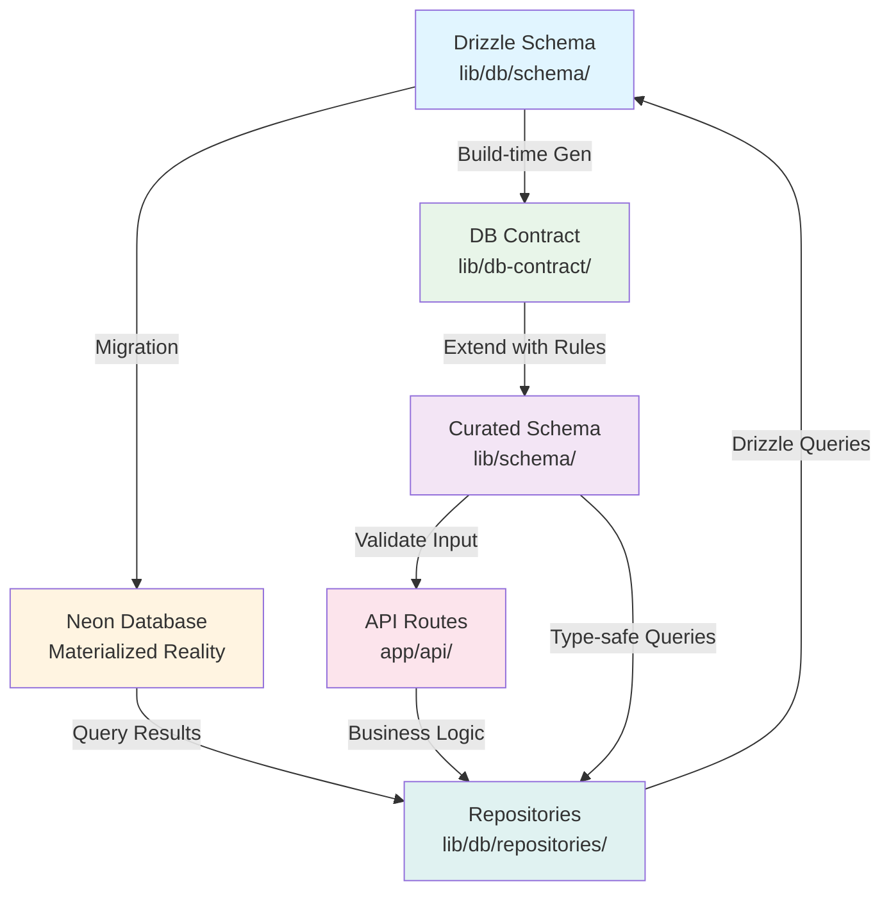

# Drizzle ORM + NeonDB: Complete Feature Analysis & Elite Strategy

## Executive Summary

This plan provides a comprehensive analysis of Drizzle ORM and NeonDB integration, identifying all features, functions, risks, and best practices to achieve elite database performance. The current setup uses `drizzle-orm/neon-serverless` with basic configuration - this analysis will identify gaps and optimization opportunities.

**Integration with AXIS Architecture:** This plan incorporates the DB-First Doctrine and Contract-First Strategy from the AXIS proposal, ensuring Drizzle schema is the source of truth with Zod contracts derived from it, not driving it. This architectural pattern enhances type safety, maintainability, and prevents schema contamination.

## 1. Drizzle ORM: Complete Feature Inventory

### 1.1 Core Query Functions

**SELECT Operations:**

- `db.select()` - Base query builder
- `.from(table)` - Specify source table
- `.where(condition)` - Filter conditions
- `.limit(n)` - Limit results
- `.offset(n)` - Pagination offset
- `.orderBy(column)` - Sorting
- `.groupBy(column)` - Grouping
- `.having(condition)` - Post-aggregation filtering
- `.distinct()` - Remove duplicates
- `.distinctOn(column)` - Distinct on specific column
- `.forUpdate()` - Row-level locking
- `.forShare()` - Shared row locking

**INSERT Operations:**

- `db.insert(table)` - Insert builder
- `.values(data)` - Insert single/multiple rows
- `.onConflictDoNothing()` - Ignore conflicts
- `.onConflictDoUpdate()` - Upsert operations
- `.returning()` - Return inserted data

**UPDATE Operations:**

- `db.update(table)` - Update builder
- `.set(data)` - Set values
- `.where(condition)` - Update conditions
- `.returning()` - Return updated data

**DELETE Operations:**

- `db.delete(table)` - Delete builder
- `.where(condition)` - Delete conditions
- `.returning()` - Return deleted data

### 1.2 Advanced Query Features

**Relations & Joins:**

- `relations()` - Define table relationships
- `.innerJoin()` - Inner join
- `.leftJoin()` - Left outer join
- `.rightJoin()` - Right outer join
- `.fullJoin()` - Full outer join
- `.lateralJoin()` - Lateral join
- `.with()` - CTE (Common Table Expressions)
- `.withRecursive()` - Recursive CTE

**Aggregations:**

- `count()`, `sum()`, `avg()`, `min()`, `max()`
- `arrayAgg()` - Array aggregation
- `jsonAgg()` - JSON aggregation
- `stringAgg()` - String aggregation

**Subqueries:**

- `.as()` - Alias subqueries
- `.exists()` - Exists subquery
- `.inArray()` - IN subquery
- `.notInArray()` - NOT IN subquery

### 1.3 Transaction Management

- `db.transaction(async (tx) => {})` - Transaction wrapper
- `tx.savepoint()` - Savepoint creation
- `tx.rollback()` - Manual rollback
- Nested transactions support
- Transaction isolation levels

### 1.4 Schema Definition Features

**Column Types:**

- `serial()`, `integer()`, `bigint()`, `smallint()`
- `varchar()`, `text()`, `char()`
- `boolean()`, `date()`, `timestamp()`, `time()`
- `json()`, `jsonb()`, `uuid()`
- `decimal()`, `numeric()`, `real()`, `doublePrecision()`
- `bytea()` - Binary data
- `array()` - Array columns
- `enum()` - Custom enums

**Column Constraints:**

- `.primaryKey()` - Primary key
- `.notNull()` - NOT NULL constraint
- `.unique()` - Unique constraint
- `.default(value)` - Default values
- `.references()` - Foreign key
- `.check()` - Check constraint
- `.generatedAlwaysAs()` - Generated columns

**Table Features:**

- `pgTable()` - Standard table
- `pgView()` - Database views
- `pgMaterializedView()` - Materialized views
- `pgIndex()` - Custom indexes
- `pgUnique()` - Unique constraints
- `pgCheck()` - Check constraints
- `pgTrigger()` - Database triggers

### 1.5 Migration Tools (drizzle-kit)

- `drizzle-kit generate` - Generate migrations
- `drizzle-kit migrate` - Run migrations
- `drizzle-kit push` - Push schema changes
- `drizzle-kit studio` - Visual schema editor
- `drizzle-kit introspect` - Introspect existing DB
- `drizzle-kit drop` - Drop migrations
- `drizzle-kit check` - Validate migrations

### 1.6 Type Inference

- `$inferSelect` - Infer SELECT types
- `$inferInsert` - Infer INSERT types
- Automatic relation type inference
- Query result type inference

## 2. NeonDB: Complete Feature Inventory

### 2.1 Serverless Architecture Features

- **Automatic Scaling:** Compute spins up/down on demand
- **Separated Compute & Storage:** Independent scaling
- **HTTP/WebSocket Support:** Multiple connection protocols
- **Edge-Compatible:** Works with edge runtimes

### 2.2 Connection Options

**Serverless Driver (`@neondatabase/serverless`):**

- `neon()` - HTTP-based connection (current setup)
- `neonConfig()` - Connection configuration
- WebSocket support for persistent connections
- Connection pooling via HTTP

**Standard PostgreSQL Driver:**

- Direct PostgreSQL protocol
- Connection pooling via PgBouncer
- Transaction pooling mode
- Session pooling mode

### 2.3 Advanced Features

- **Database Branching:** Create branches from any point in time
- **Time Travel:** Access historical database states
- **Point-in-Time Recovery:** Restore to specific timestamps
- **Automatic Backups:** Continuous backup system
- **Read Replicas:** Horizontal read scaling
- **Connection Pooling:** Built-in PgBouncer integration
- **Query Analytics:** Performance monitoring
- **Storage Optimization:** Layered storage engine

### 2.4 Security Features

- SSL/TLS encryption
- IP allowlisting
- VPC peering
- Secrets management
- Audit logging
- Role-based access control

## 3. AXIS Architecture Integration: DB-First Doctrine & Contract-First Strategy

### 3.1 Canonical Truth Chain (Non-Negotiable)

The AXIS architecture establishes a clear authority chain that prevents schema contamination and ensures portability:

```
1. Drizzle Schema (persistence blueprint) ← SOURCE OF TRUTH
2. Migrations (change log)
3. Actual DB (materialized reality)
4. Zod DB Contracts (generated from Drizzle) ← BASELINE
5. Zod API Contracts (curated from DB contracts) ← BUSINESS RULES
6. Adapters (REST/tRPC/GraphQL/Jobs/UI) ← RUNTIME
```

**Critical Rule:** Zod must NEVER drive DB shape automatically. Drizzle is the authority.

### 3.2 Architecture Flow Diagram



**Authority Flow:** Drizzle → DB → Contracts → Adapters (one-way)

### 3.3 Three-Layer Contract Pattern

#### Layer 1: `@axis/db` (Drizzle Truth)

- **Owns:** Drizzle tables, migrations
- **Must NOT import:** Zod, Next.js, observability
- **Purpose:** Pure persistence blueprint
- **Location:** `packages/db/` or `lib/db/` (current structure)
```typescript
// lib/db/schema/users.ts
import { pgTable, uuid, varchar, timestamp, index } from "drizzle-orm/pg-core";

export const users = pgTable("users", {
  id: uuid("id").defaultRandom().primaryKey(),
  email: varchar("email", { length: 255 }).notNull().unique(),
  name: varchar("name", { length: 255 }).notNull(),
  createdAt: timestamp("created_at").defaultNow().notNull(),
  updatedAt: timestamp("updated_at").defaultNow().notNull(),
}, (table) => ({
  emailIdx: index("email_idx").on(table.email),
}));
```


#### Layer 2: `@axis/db-contract` (Generated Baseline)

- **Owns:** Generated Zod schemas from Drizzle
- **May import:** `@axis/db`, Zod
- **Purpose:** Type-safe baseline contracts derived from DB
- **Generation:** Build-time via `pnpm gen:db-contract`
```typescript
// lib/db-contract/generated/users.ts
import { z } from "zod";

// Generated from Drizzle schema
export const UserSelectSchema = z.object({
  id: z.string().uuid(),
  email: z.string(),
  name: z.string(),
  createdAt: z.date(),
  updatedAt: z.date(),
});

export const UserInsertSchema = z.object({
  email: z.string(),
  name: z.string(),
  // id, createdAt, updatedAt excluded (auto-generated)
});
```


#### Layer 3: `@axis/schema` (Curated Business Contracts)

- **Owns:** Curated business/API contracts
- **May import:** `@axis/db-contract`, Zod
- **Purpose:** Business rules, validation, API contracts
- **Pattern:** Extend db-contract with additional rules
```typescript
// lib/schema/users.ts
import { z } from "zod";
import { UserInsertSchema } from "@/db-contract/generated/users";

// API contract extends DB contract with business rules
export const UserCreateRequest = UserInsertSchema.extend({
  email: z.string().email().min(5).max(255),
  name: z.string().min(1).max(255),
});

export type UserCreateRequest = z.infer<typeof UserCreateRequest>;
```


### 3.4 Architecture Boundaries

**Dependency Direction (LAW A):**

- `apps/*` → `packages/*` → (nothing above)
- Apps are runtime composition shells
- Packages are portable canon capabilities

**Server-Only Enforcement:**

```typescript
// lib/db-contract/index.ts
import "server-only"; // Prevents client-side imports
```

**Public API Locking:**

- Single entry point: `src/index.ts`
- Locked via `package.json#exports`
- Prevents deep imports and accidental coupling

### 3.5 Safe Drizzle + Zod Workflow

**When Changing DB Shape:**

1. Edit Drizzle table in `lib/db/schema/`
2. Generate migration: `pnpm db:generate`
3. Test migration on Neon branch
4. Run migration: `pnpm db:migrate`
5. Regenerate db-contract: `pnpm gen:db-contract`
6. Update curated schema if needed: `lib/schema/`
7. Update app adapters/routes

**When Adding API Endpoint:**

1. Pick curated schema from `lib/schema/`
2. Parse/validate input with Zod
3. Call domain logic / query layer
4. Return curated response shape

### 3.6 Prevention Rules (Never Break DB)

**Never Do:**

- Runtime codegen
- Auto-migrate on app boot
- Let Zod generation dictate schema changes
- Import apps from packages
- Modify migration history manually

**Always Do:**

- Explicit migrations
- Build-time generation (`pnpm gen:db-contract`)
- Regenerate contracts after DB change
- Test migrations on Neon branches
- Use server-only imports for DB packages

### 3.7 Risk Mitigation via AXIS Architecture

**Risk: Schema Contamination**

- **AXIS Solution:** Clear authority chain prevents Zod from driving DB
- **Benefit:** DB remains portable, API contracts are projections

**Risk: Type Safety Gaps**

- **AXIS Solution:** Three-layer contract ensures type safety at each level
- **Benefit:** Compile-time errors catch issues before runtime

**Risk: Migration Conflicts**

- **AXIS Solution:** DB-first workflow with Neon branching
- **Benefit:** Zero-risk migration testing before production

**Risk: Package Coupling**

- **AXIS Solution:** Public API locking and dependency direction rules
- **Benefit:** Packages remain portable, refactoring is safe

### 3.8 Key Synergies: AXIS + Elite Strategy

**Performance + Architecture:**

- AXIS's DB-first approach ensures optimal query patterns (no schema drift)
- Elite connection pooling works seamlessly with AXIS boundaries
- Type safety at all layers reduces runtime errors (better performance)

**Risk Mitigation + Architecture:**

- AXIS prevents schema contamination (mitigates migration risks)
- Three-layer contracts catch type errors early (reduces data integrity risks)
- Clear boundaries prevent coupling issues (reduces refactoring risks)

**Maintainability + Performance:**

- Portable packages enable easy optimization
- Contract generation ensures consistency
- Server-only boundaries prevent client-side DB leaks

## 4. Risk Analysis & Mitigation Strategies

### 3.1 Connection Management Risks

**Risk:** Connection exhaustion in serverless environments

- **Current Issue:** Using `neon-serverless` without connection pooling configuration
- **Mitigation:**
  - Implement connection pooling with proper limits
  - Use Neon's connection pooler URL (separate from direct URL)
  - Configure connection timeouts
  - Monitor connection metrics

**Risk:** Cold start latency

- **Mitigation:**
  - Use connection warming strategies
  - Implement connection reuse patterns
  - Consider WebSocket connections for persistent sessions

### 3.2 Transaction & Consistency Risks

**Risk:** Transaction isolation in serverless

- **Mitigation:**
  - Use explicit transaction boundaries
  - Set appropriate isolation levels
  - Implement retry logic with exponential backoff
  - Use savepoints for complex operations

**Risk:** Lost connections during transactions

- **Mitigation:**
  - Implement transaction retry mechanisms
  - Use idempotent operations
  - Add transaction timeout handling

### 3.3 Schema Migration Risks

**Risk:** Migration conflicts and inconsistencies

- **Current Gap:** No migration versioning strategy visible
- **Mitigation:**
  - Never modify migration history manually
  - Use `drizzle-kit generate` before `migrate`
  - Test migrations in staging branches
  - Implement migration rollback procedures
  - Use Neon branching for safe migration testing

**Risk:** Production migration failures

- **Mitigation:**
  - Use Neon database branches for testing
  - Implement blue-green migration strategy
  - Add migration validation checks
  - Monitor migration execution

### 3.4 Performance Risks

**Risk:** N+1 query problems

- **Mitigation:**
  - Use Drizzle relations properly
  - Implement eager loading patterns
  - Use `.with()` CTEs for complex queries
  - Monitor query performance

**Risk:** Missing indexes

- **Current Gap:** Schema lacks explicit indexes
- **Mitigation:**
  - Add indexes on foreign keys
  - Index frequently queried columns
  - Use composite indexes for multi-column queries
  - Monitor slow query logs

**Risk:** Inefficient queries

- **Mitigation:**
  - Select only needed columns
  - Use proper WHERE clause indexing
  - Avoid SELECT * in production
  - Implement query result caching

### 3.5 Data Integrity Risks

**Risk:** Missing validation

- **Current Gap:** No input validation layer
- **Mitigation:**
  - Integrate Zod schemas for validation
  - Use Drizzle's type system for compile-time checks
  - Implement runtime validation
  - Add database-level constraints

**Risk:** Race conditions

- **Mitigation:**
  - Use database-level locking (`.forUpdate()`)
  - Implement optimistic locking with version columns
  - Use unique constraints to prevent duplicates
  - Add proper transaction isolation

### 3.6 Security Risks

**Risk:** SQL injection (low with Drizzle, but still possible)

- **Mitigation:**
  - Always use parameterized queries (Drizzle default)
  - Never concatenate user input
  - Use Drizzle's query builder exclusively
  - Regular security audits

**Risk:** Exposed credentials

- **Current Gap:** Environment variable validation is basic
- **Mitigation:**
  - Use secret management services
  - Rotate credentials regularly
  - Use separate credentials per environment
  - Implement credential validation

### 3.7 Monitoring & Observability Risks

**Risk:** Lack of visibility into database operations

- **Current Gap:** No logging or monitoring setup
- **Mitigation:**
  - Implement query logging
  - Use Neon's query analytics
  - Add performance monitoring
  - Set up alerting for slow queries
  - Monitor connection pool metrics

## 5. Elite Database Strategy: Best Practices

### 4.1 Connection Strategy

**Current State:** Basic serverless connection

**Elite Strategy:**

```typescript
// Use connection pooling for production
import { Pool } from '@neondatabase/serverless'
import { drizzle } from 'drizzle-orm/neon-serverless'

const pool = new Pool({ connectionString: process.env.DATABASE_URL })
export const db = drizzle(pool, { schema })
```

**Best Practices:**

- Use connection pooler URL for production
- Configure appropriate pool size (10-20 for serverless)
- Implement connection health checks
- Use separate pools for read/write operations if needed

### 4.2 Schema Design Strategy

**Elite Schema Patterns:**

- Normalize to 3NF, denormalize strategically
- Use UUIDs for distributed systems
- Add `created_at` and `updated_at` to all tables
- Implement soft deletes with `deleted_at`
- Use enums for fixed value sets
- Add indexes on all foreign keys
- Composite indexes for common query patterns

**Example Elite Schema:**

```typescript
export const users = pgTable("users", {
  id: uuid("id").primaryKey().defaultRandom(),
  email: varchar("email", { length: 255 }).notNull().unique(),
  name: varchar("name", { length: 255 }).notNull(),
  createdAt: timestamp("created_at").defaultNow().notNull(),
  updatedAt: timestamp("updated_at").defaultNow().notNull(),
  deletedAt: timestamp("deleted_at"),
}, (table) => ({
  emailIdx: index("email_idx").on(table.email),
  createdAtIdx: index("created_at_idx").on(table.createdAt),
}))
```

### 4.3 Query Optimization Strategy

**Elite Query Patterns:**

- Always select specific columns
- Use relations for joins instead of manual joins
- Implement pagination with cursor-based approach
- Use CTEs for complex queries
- Batch operations when possible
- Use prepared statements for repeated queries

**Example:**

```typescript
// Elite: Specific columns, relation-based
const users = await db.query.users.findMany({
  columns: { id: true, email: true, name: true },
  with: { posts: { columns: { id: true, title: true } } },
  limit: 20,
  offset: 0,
})
```

### 4.4 Transaction Strategy

**Elite Transaction Patterns:**

- Keep transactions short
- Use savepoints for complex operations
- Implement retry logic
- Use appropriate isolation levels
- Handle deadlocks gracefully

**Example:**

```typescript
async function eliteTransaction() {
  return await db.transaction(async (tx) => {
    // Operations
    const user = await tx.insert(users).values(data).returning()
    await tx.insert(posts).values({ userId: user[0].id, ...postData })
    return user
  }, {
    isolationLevel: 'read committed',
  })
}
```

### 4.5 Migration Strategy

**Elite Migration Workflow:**

1. Create feature branch in Neon
2. Test migrations on branch
3. Generate migration: `pnpm db:generate`
4. Review migration SQL
5. Test migration: `pnpm db:migrate` on branch
6. Merge branch to staging
7. Apply to production during maintenance window

**Best Practices:**

- Never skip migration steps
- Always backup before migrations
- Use Neon branching for zero-risk testing
- Implement migration rollback procedures
- Version control all migrations

### 4.6 Validation Strategy (AXIS-Enhanced)

**Elite Validation Pattern with DB-First Doctrine:**

```typescript
// Step 1: Use curated schema from @axis/schema (Layer 3)
import { UserCreateRequest } from '@/schema/users'
import { db } from '@/db'
import { users } from '@/db/schema'

// Step 2: Validate with Zod (from curated contract)
export async function createUser(data: unknown) {
  // Validate against API contract (includes business rules)
  const validated = UserCreateRequest.parse(data)
  
  // Insert using Drizzle (type-safe from schema)
  const [newUser] = await db.insert(users).values(validated).returning()
  return newUser
}
```

**Benefits of AXIS Pattern:**

- Type safety at compile-time (Drizzle types)
- Runtime validation (Zod contracts)
- Business rules enforced (curated schemas)
- Single source of truth (Drizzle schema)
- No schema drift (contracts derived from DB)

### 4.7 Error Handling Strategy

**Elite Error Handling:**

- Custom error types for database errors
- Retry logic for transient failures
- Graceful degradation
- Comprehensive logging
- User-friendly error messages

### 4.8 Monitoring Strategy

**Elite Monitoring Setup:**

- Query performance logging
- Slow query alerts (>100ms)
- Connection pool metrics
- Error rate tracking
- Transaction duration monitoring
- Use Neon's built-in analytics

### 4.9 Caching Strategy

**Elite Caching:**

- Cache frequently accessed data
- Invalidate on writes
- Use Redis for distributed caching
- Implement cache-aside pattern
- Cache query results, not connections

### 4.10 Security Strategy

**Elite Security:**

- Use parameterized queries (Drizzle default)
- Implement rate limiting
- Use least privilege database users
- Encrypt sensitive data at rest
- Regular security audits
- Use Neon's IP allowlisting
- Rotate credentials regularly

## 6. Implementation Roadmap (AXIS-Enhanced)

### Phase 1: Foundation (Current → Basic Elite + AXIS Architecture)

1. **Establish DB-First Structure:**

   - Organize `lib/db/` as Drizzle truth layer
   - Create `lib/db-contract/` for generated Zod schemas
   - Create `lib/schema/` for curated business contracts
   - Add `server-only` imports to DB packages

2. **Connection & Infrastructure:**

   - Add connection pooling configuration
   - Implement proper error handling
   - Set up basic query logging
   - Add indexes to schema

3. **Contract Generation:**

   - Create build script: `pnpm gen:db-contract`
   - Generate Zod schemas from Drizzle tables
   - Set up curated schema layer extending db-contract

4. **Validation Layer:**

   - Implement validation using curated schemas
   - Ensure all API endpoints use schema contracts
   - Add type inference from Drizzle + Zod

### Phase 2: Optimization (Basic → Advanced Elite + AXIS Boundaries)

1. **Architecture Enforcement:**

   - Add ESLint rules for dependency direction
   - Lock public APIs with `package.json#exports`
   - Enforce server-only boundaries
   - Prevent deep imports

2. **Repository Pattern (AXIS-Compatible):**

   - Implement repository pattern using Drizzle
   - Repositories consume curated schemas
   - Type-safe queries with relation inference

3. **Advanced Features:**

   - Add transaction retry logic
   - Set up monitoring and alerting
   - Optimize queries with relations
   - Implement caching strategy

4. **Migration Workflow:**

   - Integrate Neon branching for migration testing
   - Automate contract regeneration after migrations
   - Add migration validation checks

### Phase 3: Advanced (Advanced → Elite)

1. Use Neon branching for migrations
2. Implement read replicas if needed
3. Advanced query optimization
4. Comprehensive testing strategy
5. Performance benchmarking

## 7. Key Files to Modify (AXIS Structure)

### Layer 1: DB (Drizzle Truth)

- [`lib/db/index.ts`](lib/db/index.ts) - Connection pooling, error handling, add `server-only`
- [`lib/db/schema.ts`](lib/db/schema.ts) - Add indexes, constraints, relations
- [`lib/db/schema/users.ts`](lib/db/schema/users.ts) - Example table schema
- [`drizzle.config.ts`](drizzle.config.ts) - Migration configuration

### Layer 2: DB Contract (Generated)

- `lib/db-contract/index.ts` - Public API, add `server-only`
- `lib/db-contract/generated/users.ts` - Generated Zod from Drizzle
- `scripts/gen-db-contract.ts` - Build-time generator script

### Layer 3: Schema (Curated)

- `lib/schema/index.ts` - Public API, add `server-only`
- `lib/schema/users.ts` - Curated business contracts
- `lib/schema/common.ts` - Shared validation utilities

### Supporting Infrastructure

- `lib/db/repositories/` - Repository pattern (consumes schemas)
- `lib/db/middleware/` - Logging, monitoring
- `lib/db/utils/` - Helper functions
- `package.json` - Add `gen:db-contract` script, configure exports

## 8. Success Metrics (Elite + AXIS Compliance)

**Elite Condition Indicators:**

**Performance Metrics:**

- Query p95 latency < 50ms
- Zero connection pool exhaustion
- 100% migration success rate
- Zero data integrity issues
- <1% error rate
- All queries use indexes
- Proper transaction boundaries

**AXIS Architecture Compliance:**

- ✅ All DB changes originate from Drizzle schema
- ✅ Zod contracts generated from Drizzle (never drive DB)
- ✅ Three-layer contract pattern implemented
- ✅ Zero package boundary violations
- ✅ Server-only boundaries enforced
- ✅ Public APIs locked via exports
- ✅ Contract regeneration automated after migrations
- ✅ Comprehensive test coverage
- ✅ Type safety at all layers (Drizzle + Zod)